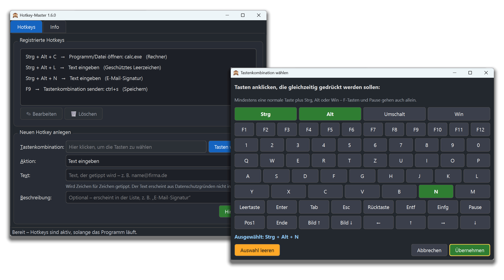
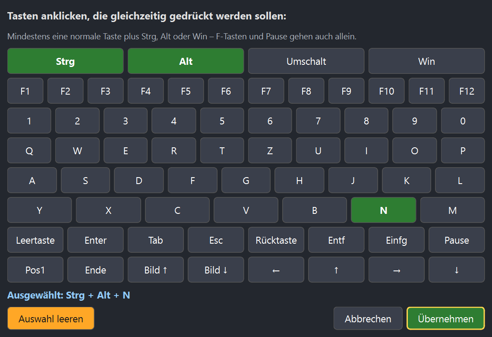

<p align="center">
  
</p>

<h1 align="center">Hotkey-Master</h1>

<p align="center">
  Eigene Tastenkürzel für Windows – Text tippen, Programme öffnen oder andere Tasten senden,
  mit einem einzigen Tastendruck, in jedem Programm.
</p>

<p align="center">
  <a href="https://github.com/Wolfram33/hotkeymaster/releases/latest/download/Hotkey-Master-Setup.exe"><strong>⬇ Neueste Version herunterladen (Installer)</strong></a>
  ·
  <a href="https://github.com/Wolfram33/hotkeymaster/releases/latest">Alle Downloads</a>
</p>

<p align="center">
  <a href="https://github.com/Wolfram33/hotkeymaster/releases/latest"></a>
  <a href="LICENSE"></a>
  
</p>



## Was kann Hotkey-Master?

| Aktion | Beispiel |
|---|---|
| **Text eingeben** – tippt einen festgelegten Text ins aktive Fenster, auch in Passwortfelder | <kbd>Strg</kbd>+<kbd>Alt</kbd>+<kbd>N</kbd> → „Mit freundlichen Grüßen …“ |
| **Programm/Datei öffnen** – startet Programme, öffnet Dateien oder Ordner | <kbd>Strg</kbd>+<kbd>Alt</kbd>+<kbd>C</kbd> → Rechner |
| **Tastenkombination senden** – löst andere Tastenkürzel aus | <kbd>F9</kbd> → <kbd>Strg</kbd>+<kbd>S</kbd> (Speichern) |

- Hotkeys wirken **systemweit**, auch wenn Hotkey-Master minimiert ist.
- Tastenkombinationen werden bequem auf einer **Bildschirm-Tastatur** zusammengeklickt.
- Ungeeignete Kombinationen (z. B. nur „A“) werden mit Begründung abgelehnt.
- Einträge lassen sich jederzeit **bearbeiten** (Doppelklick) und **löschen** (mit Rückfrage).
- Keine Internetverbindung, kein Konto, keine Telemetrie.

## Installation

1. [**Hotkey-Master-Setup.exe**](https://github.com/Wolfram33/hotkeymaster/releases/latest/download/Hotkey-Master-Setup.exe) herunterladen – der Link liefert immer die neueste Version.
2. Installer starten. Administratorrechte sind nicht nötig.
3. Zeigt Windows „Der Computer wurde durch Windows geschützt“ an: **Weitere Informationen → Trotzdem ausführen**.
   Die Meldung erscheint, weil der Installer nicht kostenpflichtig signiert ist.

Ohne Installation: unter [Alle Downloads](https://github.com/Wolfram33/hotkeymaster/releases/latest) liegt zusätzlich
`Hotkey-Master-portable.zip` – entpacken und `hotkey-master.exe` im Ordner starten.

Ein **Update** installiert man einfach über die vorhandene Version – die Hotkeys bleiben erhalten.

### Virenschutz meldet „Trojan:Win32/Wacatac“?

Das ist ein **Fehlalarm**. Windows Defender stuft per maschinellem Lernen („!ml“) unsignierte Programme,
die Tastatureingaben überwachen, gelegentlich als verdächtig ein – genau das muss ein Hotkey-Programm aber tun.
Der komplette Quellcode liegt offen in diesem Repository.

- Bitte **Version 1.6.2 oder neuer** verwenden: Ab dort ist das Programm so gebaut, dass Defender es nicht mehr beanstandet.
  Die Versionen 1.6.0 und 1.6.1 wurden blockiert und starteten nicht.
- Tritt die Meldung trotzdem auf, hilft eine Meldung an Microsoft als Fehlalarm:
  [microsoft.com/wdsi/filesubmission](https://www.microsoft.com/en-us/wdsi/filesubmission) („Incorrectly detected as malware“).

## So geht's

1. Unter **Tastenkombination** ins Feld klicken und auf der Bildschirm-Tastatur die Tasten wählen,
   z. B. <kbd>Strg</kbd> + <kbd>Alt</kbd> + <kbd>N</kbd> → **Übernehmen**.
2. Die **Aktion** wählen und das Feld darunter ausfüllen (Text, Programm oder Tasten).
3. Optional eine **Beschreibung** eintragen und auf **Hinzufügen** klicken – fertig.

<p align="center">
  
</p>

### Gut zu wissen

- Ein Hotkey braucht <kbd>Strg</kbd>, <kbd>Alt</kbd> oder <kbd>Win</kbd> plus eine normale Taste.
  F-Tasten und <kbd>Pause</kbd> gehen auch allein.
- Auf deutschen Tastaturen ist <kbd>AltGr</kbd> dasselbe wie <kbd>Strg</kbd>+<kbd>Alt</kbd>.
  Kombinationen wie <kbd>Strg</kbd>+<kbd>Alt</kbd>+<kbd>E</kbd> (€) oder <kbd>Strg</kbd>+<kbd>Alt</kbd>+<kbd>Q</kbd> (@) daher meiden.
- Text und gesendete Tasten starten erst, wenn Strg/Alt/Umschalt/Win losgelassen sind.
- In Programmen, die als Administrator laufen, wirken Hotkeys nur, wenn auch Hotkey-Master als Administrator läuft.
- Die Hotkeys liegen in `%USERPROFILE%\.productivity_hub\config.json`.
- Alle Details stehen im Reiter **Info** im Programm.

## Selbst bauen

Voraussetzungen: Windows, [Python 3.12](https://www.python.org/downloads/),
[Visual Studio Build Tools](https://visualstudio.microsoft.com/de/visual-cpp-build-tools/) (C++)
und für den Installer [Inno Setup 6](https://jrsoftware.org/isdl.php).

```powershell
python -m pip install -r requirements.txt nuitka
python hotkey-master.py        # direkt starten
pwsh ./build.ps1               # baut dist\Hotkey-Master\ (Programmordner), das ZIP und den Installer
```

## Neue Version veröffentlichen

1. `APP_VERSION` in `hotkey-master.py` erhöhen (z. B. `1.6.1`) und committen.
2. Passenden Tag setzen und pushen:
   ```powershell
   git tag v1.6.1
   git push origin main v1.6.1
   ```
3. Die GitHub-Action [`release.yml`](.github/workflows/release.yml) baut `.exe` und Installer und veröffentlicht
   sie als neues Release. Der Download-Link oben zeigt danach automatisch auf die neue Version.

Passen Tag und `APP_VERSION` nicht zusammen, bricht der Build mit einer Meldung ab.

## Lizenz

Hotkey-Master ist Open Source unter der [Apache-Lizenz 2.0](LICENSE) – Nutzung, Änderung und Weitergabe
sind erlaubt, auch kommerziell. Verwendete Bibliotheken und deren Lizenzen stehen in [NOTICE](NOTICE).

Hinweis: Die fertige `.exe` enthält [PyQt6](https://www.riverbankcomputing.com/software/pyqt/), das unter der
GPL v3 steht. Wer die kompilierte Fassung weitergibt, hält daher zusätzlich deren Bedingungen ein
(u. a. Verweis auf den Quellcode – dieses Repository).

## Autor

**Rob de Roy** – Wolfram Consult GmbH & Co. KG
